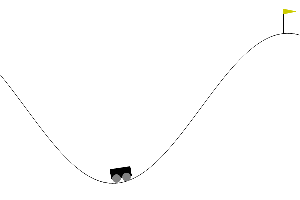

# SimpleSimpleNEAT

This is my own implementation of NEAT (NeuroEvolution of Augmenting Topologies),
written from scratch without any neuroevolution library. I mostly built it to
actually understand how NEAT works instead of just reading about it.



The gif is a network evolved with this code solving MountainCar-v0. It reaches the
flag in about 122 steps.

## Why I made this

I'm really into reinforcement learning, and I think evolutionary algorithms are
super cool. The idea that just selection, mutation and crossover can produce
something that actually works still kind of amazes me, and with NEAT you don't only
evolve the weights of the network but its structure too, which I find fascinating.
So instead of using a library I wanted to write it myself and see if I could get it
to work.

## What it does

It starts with a population of tiny networks and evolves them over many generations,
mutating the weights, adding new nodes and connections, and combining the best ones,
until they get good at the task. You set the environment, population size, mutation
rates and so on in `src/config.yaml`.

## How to run it

I use [uv](https://github.com/astral-sh/uv):

```bash
uv sync
uv run python src/neat.py
```

Small heads up: at the moment the training loop inside `main()` is commented out and
it runs a little compatibility-distance demo instead. The `record_demo.py` script is
the one I used to actually train on MountainCar and save the gif above, so look there
if you want to see a full training run.

## Still todo

Speciation isn't done yet. Right now selection is just tournament selection over the
whole population, so that's the next thing I want to add.
